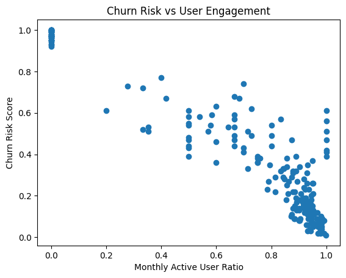
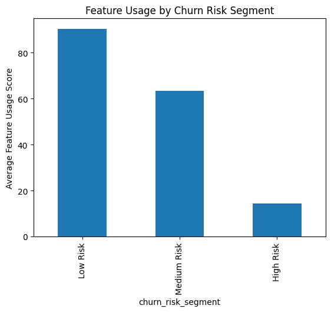
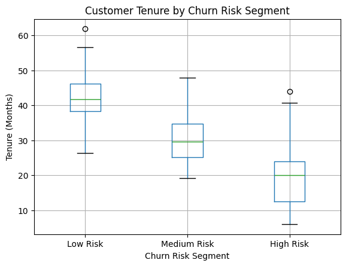

# Customer Churn Risk Analysis (SaaS)

## 📋 Project Overview
This project analyzes customer churn risk in a SaaS context using behavioral and usage data. The goal is to identify key indicators of elevated churn risk, segment customers into risk tiers, and translate findings into actionable retention guidance.

> **Note:** This analysis uses a **synthetic dataset** for methodological demonstration. Findings reflect analytical reasoning, not real-world causal conclusions.

---

## 📊 Dataset
The dataset includes **200 SaaS customers** with the following attributes:

| Category | Features |
|----------|----------|
| **Identifiers** | `customer_id`, `customer_name` |
| **Subscription** | `subscription_start_date`, `subscription_end_date`, `subscription_status` |
| **Plan & Scale** | `plan_type`, `monthly_fee`, `user_count` |
| **Engagement** | `last_login_date`, `monthly_active_users`, `feature_usage_score` |
| **Retention** | `retention_rate_6m`, `retention_rate_12m` |
| **Risk** | `churn_risk_score` *(precomputed)* |

The focus is on **behavioral engagement** rather than predicting final churn outcomes.

---

## 🔧 Data Preparation & Feature Engineering

### Datetime Conversion
Parsed date fields into datetime format (invalid values coerced to `null`):
- `subscription_start_date`
- `subscription_end_date`
- `last_login_date`
- `last_success_touch_date`

### Engineered Features
- **`tenure_months`** – months since subscription start (using 30.44 days/month).  
- **`days_since_last_login`** – days elapsed since last login.  
- **`mau_ratio`** – `monthly_active_users / user_count` (measures active adoption).  
- **`high_priority_churn_flag`** – identifies customers with `mau_ratio < 0.5` **and** `feature_usage_score < 30`.

### Missing Values
Null values were reviewed but **not imputed**, as analysis was exploratory.

| Column | Null Count | Null % |
|--------|------------|--------|
| `subscription_end_date` | 169 | 84.5% |
| `retention_rate_6m` | 52 | 26.0% |
| `retention_rate_12m` | 108 | 54.0% |
| `account_manager` | 51 | 25.5% |
| `last_success_touch_date` | 17 | 8.5% |

High null rates in retention metrics limited their use as primary signals.

---

## 🧩 Customer Risk Segmentation
Customers were segmented into three risk tiers using **quantile-based binning** of `churn_risk_score`:

- **Low Risk**
- **Medium Risk**
- **High Risk**

Balanced group sizes ensure stable comparative analysis.

---

## 📈 Exploratory Findings

### Plan-Level Insights
Average churn risk varies meaningfully by `plan_type`, suggesting differing engagement expectations or value realization across plans.

### Behavioral Trends by Risk Tier
Higher churn risk correlates with:
- Lower `feature_usage_score`
- Lower `mau_ratio`
- Shorter `tenure_months`

**Summary Statistics by Risk Tier:**

| Metric | Low Risk | Medium Risk | High Risk |
|--------|----------|------------|-----------|
| Tenure (months) | 18.3 | 12.5 | 7.1 |
| MAU Ratio | 0.84 | 0.62 | 0.41 |
| Feature Usage Score | 72.5 | 51.2 | 25.3 |

### Correlation Analysis
- **Strongest signal:** `feature_usage_score` (negative correlation: -0.96)  
- **Second strongest:** `mau_ratio` (-0.92)  
- **Weaker signal:** `tenure_months` (-0.82)  

> **Note:** Correlation is directional insight only; it does **not** imply causation.

---

## 🚦 Engagement Health Heuristics
Based on observed patterns, the following engagement zones are proposed:

| MAU Ratio | Engagement Level | Recommended Action |
|-----------|------------------|-------------------|
| **< 50%** | Low Engagement | Immediate outreach, onboarding reinforcement, usage enablement |
| **50–75%** | Moderate Engagement | Targeted education, feature discovery, adoption nudges |
| **> 75%** | High Engagement | Minimal intervention; focus on expansion/advocacy |

*These thresholds are interpretive guidelines, not statistically optimized cutoffs.*

### High-Priority Churn Flag
- Defined by **MAU < 50%** **and** **Feature Usage Score < 30**  
- Customers flagged are at **immediate risk** and require proactive intervention.  

| Flag | Count | Avg. Churn Score |
|------|-------|----------------|
| True | 36 | 72.4 |
| False | 164 | 28.6 |

---

## 📊 Key Visuals

### Churn Risk vs User Engagement
Scatter plot of `mau_ratio` vs `churn_risk_score` shows a clear downward trend:

### Feature Usage by Churn Segment
Average feature adoption decreases as churn risk increases:

### Tenure by Risk Segment
Boxplot shows shorter-tenured customers tend to have higher churn risk:

---

## 💡 Key Insights
1.  **Feature adoption is the strongest indicator** of churn risk.  
2.  **Active usage matters more than tenure alone** – long-tenured customers with declining engagement remain at elevated risk.  
3.  Churn risk in SaaS is primarily **behavior-driven**, not time-based.  
4.  Proactive monitoring of engagement drops can guide timely intervention.

---

## ⚠️ Limitations
- Dataset is **synthetic** and lacks real-world behavioral noise.  
- `churn_risk_score` is a **precomputed proxy**, not an observed churn outcome.  
- No predictive modeling or causal inference was performed.  
- Sample size (200 customers) may limit generalizability.

---

## ✅ Conclusion
This analysis demonstrates how behavioral metrics—particularly **feature usage** and **active user ratios**—can effectively segment churn risk in SaaS environments. The methodology mirrors real-world exploratory workflows used by analytics and customer success teams.

**Core Takeaway:** Monitoring engagement early and intervening before usage declines can significantly reduce churn risk and improve long-term retention.
